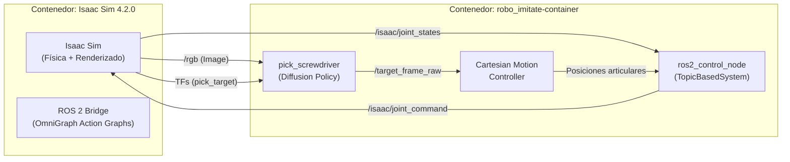

# Plan: Levantar Simulación robo_imitate (Diffusion Policy + Isaac Sim + ROS 2)

## Situación Actual

**Problema descubierto:** NVIDIA **eliminó** los tags `2023.1.x` del registro NGC. Los tags disponibles actualmente son:

```
6.0.0, 6.0.0-dev3, 6.0.0-dev2, 5.1.0, 5.0.0, 4.5.0, 4.2.0, 4.1.0, 4.0.0,
2022.2.1, 2022.2.0, 2022.1.1, 2022.1.0, 2021.x, 2020.x
```

> [!WARNING]
> **No existe `2023.1.1` en NGC.** El contexto original del proyecto asumía esa versión, pero fue eliminada del registro.

### Versión recomendada: `4.2.0`

| Versión | ROS 2 Bridge OmniGraph | Tamaño | Compatibilidad |
|---------|----------------------|--------|----------------|
| `2022.2.1` | ✅ API antigua (muy vieja) | ~10 GB | Posiblemente más cercana al código original, pero puede tener bugs |
| `4.0.0` | ✅ OmniGraph actualizado | ~10 GB | Primera versión post-2023, algunos nodos renombrados |
| **`4.2.0`** | ✅ **OmniGraph estable** | ~10 GB | **Mejor balance: estable + compatible con ROS 2 Humble** |
| `5.x / 6.x` | ⚠️ API muy cambiada | ~10-21 GB | Requiere reescribir Action Graphs completamente |

**Isaac Sim 4.2.0** es la mejor opción porque:
- Tiene el **ROS 2 Bridge Extension** con OmniGraph (Action Graphs).
- Soporta **ROS 2 Humble** (el que usa `robo_imitate-container`).
- Los nodos de OmniGraph son muy similares a los de 2023.1.x.
- Es la versión estable más cercana a lo que el proyecto original esperaba.

---

## Arquitectura del Sistema



---

## Pasos de Ejecución

### Fase 0: Prerequisitos en el Host

**Paso 0.1** — Permitir acceso X11 a Docker:
```bash
xhost +local:docker
```

**Paso 0.2** — Verificar driver NVIDIA (necesita ≥ 525.60):
```bash
nvidia-smi
```

**Paso 0.3** — Verificar espacio en disco (~10 GB necesarios):
```bash
df -h /
```

---

### Fase 1: Descargar Isaac Sim 4.2.0

**Paso 1.1** — Descargar la imagen:
```bash
docker pull nvcr.io/nvidia/isaac-sim:4.2.0
```

---

### Fase 2: Crear y arrancar el contenedor de Isaac Sim

**Paso 2.1** — Crear directorios de caché (mejora rendimiento y evita recompilar shaders cada vez):
```bash
mkdir -p ~/docker/isaac-sim/cache/kit
mkdir -p ~/docker/isaac-sim/cache/ov
mkdir -p ~/docker/isaac-sim/cache/pip
mkdir -p ~/docker/isaac-sim/cache/glcache
mkdir -p ~/docker/isaac-sim/cache/computecache
mkdir -p ~/docker/isaac-sim/logs
mkdir -p ~/docker/isaac-sim/data
```

**Paso 2.2** — Lanzar el contenedor Isaac Sim:
```bash
docker run --name isaac-sim-4.2 \
    --entrypoint bash \
    -it \
    --gpus all \
    -e "ACCEPT_EULA=Y" \
    --network=host \
    -e DISPLAY=$DISPLAY \
    -v /tmp/.X11-unix:/tmp/.X11-unix \
    -v ~/docker/isaac-sim/cache/kit:/isaac-sim/kit/cache:rw \
    -v ~/docker/isaac-sim/cache/ov:/root/.cache/ov:rw \
    -v ~/docker/isaac-sim/cache/pip:/root/.cache/pip:rw \
    -v ~/docker/isaac-sim/cache/glcache:/root/.cache/nvidia/GLCache:rw \
    -v ~/docker/isaac-sim/cache/computecache:/root/.nv/ComputeCache:rw \
    -v ~/docker/isaac-sim/logs:/root/.nvidia-omniverse/logs:rw \
    -v ~/docker/isaac-sim/data:/root/.local/share/ov/data:rw \
    -v ~/Documents/gits/robo_imitate:/workspace/robo_imitate \
    nvcr.io/nvidia/isaac-sim:4.2.0
```

> [!NOTE]
> **Puntos clave del comando:**
> - `--network=host` + sin definir `ROS_DOMAIN_ID` y `RMW_IMPLEMENTATION` aún — primero necesitamos verificar qué DDS viene con esta imagen.
> - Se monta el repositorio en `/workspace/robo_imitate` para acceder a las escenas USD.
> - Los volúmenes de caché aceleran los arranques posteriores.

---

### Fase 3: Dentro de Isaac Sim — Instalar y configurar ROS 2

**Paso 3.1** — Instalar ROS 2 Humble base (requerido para el ROS 2 Bridge en 4.2.0):
```bash
# Dentro del contenedor isaac-sim-4.2 (como root)
apt-get update && apt-get install -y curl software-properties-common
curl -sSL https://raw.githubusercontent.com/ros/rosdistro/master/ros.key -o /usr/share/keyrings/ros-archive-keyring.gpg
echo "deb [arch=$(dpkg --print-architecture) signed-by=/usr/share/keyrings/ros-archive-keyring.gpg] http://packages.ros.org/ros2/ubuntu $(. /etc/os-release && echo $UBUNTU_CODENAME) main" | tee /etc/apt/sources.list.d/ros2.list > /dev/null
apt-get update && apt-get install -y ros-humble-ros-base
```

**Paso 3.2** — Activar ROS 2 en el entorno:
```bash
source /opt/ros/humble/setup.bash
echo $ROS_DISTRO   # Debe decir "humble"
```

> [!IMPORTANT]
> Por defecto, ROS 2 Humble usa **FastDDS** (`ROS_DOMAIN_ID=0`). Para que la comunicación funcione, debemos asegurar que el contenedor `robo_imitate-container` también use FastDDS (ver Fase 5).

**Paso 3.3** — Lanzar Isaac Sim con GUI:
```bash
./runapp.sh
```

> [!NOTE]
> **La primera ejecución tardará 5-15 minutos** compilando shaders. Las siguientes serán más rápidas gracias a los volúmenes de caché.

---

### Fase 4: Cargar la escena y configurar Action Graphs

**Paso 4.1** — Una vez Isaac Sim esté abierto (GUI):

1. `File → Open` → Navegar a `/workspace/robo_imitate/xarm_bringup/isaac/object_picking.usda`

2. **Verificar que el ROS 2 Bridge Extension esté habilitado:**
   - `Window → Extensions` → Buscar "ROS 2 Bridge" → Asegurar que está **Enabled**

3. **Verificar los Action Graphs existentes en la escena:**
   - La escena `object_picking.usda` probablemente ya tiene Action Graphs preconfigurados que:
     - Publican `/isaac/joint_states` (sensor_msgs/JointState)
     - Suscriben a `/isaac/joint_command` (sensor_msgs/JointState) 
     - Publican `/rgb` (sensor_msgs/Image desde una cámara simulada)
     - Publican TFs incluyendo `pick_target` (para la posición del destornillador)
     - Suscriben a `/respawn` (para re-posicionar el destornillador aleatoriamente)

4. **Presionar Play (▶️)** para iniciar la simulación.

**Paso 4.2** — Verificar que los topics se publican. Abrir otro terminal en el host:
```bash
# Verificar desde robo_imitate-container (o instalar ros2 en el host)
docker exec -it robo_imitate-container bash -c "source /opt/ros/humble/setup.bash && ros2 topic list"
```

Deberías ver al menos:
- `/isaac/joint_states`
- `/isaac/joint_command`
- `/rgb`
- `/tf` y `/tf_static`

> [!WARNING]
> **Si los topics NO aparecen**, es un problema de DDS. Ambos contenedores deben usar el **mismo middleware DDS** y el **mismo `ROS_DOMAIN_ID`**. Ve la sección Troubleshooting al final.

> [!WARNING]  
> **Si los Action Graphs de la escena USD no son compatibles con Isaac Sim 4.2.0** (nodos renombrados, etc.), necesitaremos recrearlos. Los nodos necesarios son:
> - `On Playback Tick` → Trigger
> - `Isaac Read Simulation Time` → Timestamp  
> - `ROS2 Publish Joint State` → Publica en `/isaac/joint_states`
> - `ROS2 Subscribe Joint State` → Suscribe a `/isaac/joint_command`
> - `Articulation Controller` → Mueve las articulaciones del robot
> - `ROS2 Camera Helper` → Publica en `/rgb`
> - `ROS2 Publish Transform Tree` → Publica TFs
>
> Si necesitas que te guíe en la creación de estos Action Graphs, dime y te doy instrucciones paso a paso.

---

### Fase 5: Arrancar el Controlador ROS 2 (robo_imitate-container)

**Paso 5.1** — Asegurar que el contenedor está corriendo:
```bash
docker start robo_imitate-container
```

**Paso 5.2** — Entrar al contenedor (Terminal 1):
```bash
docker exec -it robo_imitate-container bash
```

**Paso 5.3** — (Solo si cambias a FastDDS) Desactivar CycloneDDS:
```bash
unset RMW_IMPLEMENTATION
unset CYCLONEDDS_URI
export ROS_DOMAIN_ID=101
```

**Paso 5.4** — Compilar paquetes (si es necesario):
```bash
cd ~/ros2_ws
colcon build --symlink-install --cmake-args -DBUILD_TESTING=OFF
source install/local_setup.bash
```

**Paso 5.5** — Lanzar el controlador cartesiano:
```bash
ros2 launch xarm_bringup lite6_cartesian_launch.py rviz:=false sim:=true
```

---

### Fase 6: Ejecutar la Inferencia del Modelo

**Paso 6.1** — Abrir segundo terminal en robo_imitate-container:
```bash
docker exec -it robo_imitate-container bash
```

**Paso 6.2** — Ejecutar el script de inferencia:
```bash
cd ~/ros2_ws/src/robo_imitate
./imitation/pick_screwdriver --sim
```

---

## Flujo de Re-Entrenamiento

### Fase A: Recolección de Datos (Demostraciones Automáticas)
En vez de manejar el robot tú mismo, hay un script heurístico (`episode_generator_picking`) que sabe cómo agarrar el destornillador usando matemáticas. Usaremos esto para generar los datos de entrenamiento.

1. **Inicia Isaac Sim** (dale Play) y el controlador base:
```bash
ros2 launch xarm_bringup lite6_cartesian_launch.py rviz:=false sim:=true
```

2. **Abre otra terminal e inicia el grabador de episodios** (esto guardará las imágenes de la cámara y las poses en la carpeta `DATA`):
```bash
cd ~/ros2_ws/src/robo_imitate
./xarm_bringup/scripts/episode_recorder --data_dir ~/ros2_ws/src/robo_imitate/DATA
```

3. **Abre una 3ra terminal e inicia el generador automático**:
```bash
cd ~/ros2_ws/src/robo_imitate
./xarm_bringup/scripts/episode_generator_picking
```

> [!TIP]
> 👉 Déjalo correr por un buen rato (ej. 30 a 50 episodios). Verás que el robot agarra el destornillador, lo levanta, lo suelta, lo mueve a otro lugar y repite. Cuando sientas que es suficiente, presiona `Ctrl+C` en los scripts.

---

### Fase B: Convertir los Datos a formato Parquet
La red neuronal no lee las imágenes sueltas, necesita un archivo comprimido `.parquet`.

1. **En la terminal del contenedor, ejecuta el conversor:**
```bash
cd ~/ros2_ws/src/robo_imitate
./xarm_bringup/scripts/save_parquet --data_path DATA
```

Esto creará un archivo llamado algo parecido a `2024_xx_xx.parquet`. Debes moverlo y reemplazar el viejo archivo de datos:

2. **Mover y reemplazar archivo:**
```bash
mv ~/ros2_ws/src/robo_imitate/DATA/parquest_output/*.parquet ~/ros2_ws/src/robo_imitate/imitation/data/sim_env_data.parquet
```

---

### Fase C: Re-Entrenar el Modelo
Ahora sí, entrena la red neuronal con tus nuevos datos impecables.

1. **Calcula las estadísticas de normalización del nuevo dataset:**
```bash
cd ~/ros2_ws/src/robo_imitate
python3 ./imitation/compute_stats --path imitation/data/sim_env_data.parquet
```

2. **Inicia el entrenamiento** (puedes subir a `--epoch 2000` si quieres que aprenda mejor):
```bash
python3 ./imitation/train_script --path imitation/data/sim_env_data.parquet --epoch 1000
```

> [!NOTE]
> Una vez que termine de entrenar, los nuevos pesos sobreescribirán los anteriores en `imitation/outputs/train/`. Si repites tu prueba con `pick_screwdriver`, ¡el robot ahora debería acertar el agarre!

---

## Resumen de Terminales

| # | Dónde | Qué ejecutar |
|---|-------|-------------|
| 1 | **Host** | `xhost +local:docker` |
| 2 | **Isaac Sim 4.2.0** | `./runapp.sh` → Abrir escena → Play |
| 3 | **robo_imitate-container (T1)** | `ros2 launch xarm_bringup lite6_cartesian_launch.py rviz:=false sim:=true` |
| 4 | **robo_imitate-container (T2)** | `cd ~/ros2_ws/src/robo_imitate && ./imitation/pick_screwdriver --sim` |

---

## Troubleshooting

### Los topics de Isaac Sim no aparecen en robo_imitate-container
**Causa más probable:** DDS mismatch.
```bash
# En Isaac Sim:
echo $RMW_IMPLEMENTATION    # Probablemente vacío (=FastDDS por defecto)

# En robo_imitate-container:
echo $RMW_IMPLEMENTATION    # Dice "rmw_cyclonedds_cpp"
```
**Solución:** Unificar. En `robo_imitate-container` ejecutar:
```bash
unset RMW_IMPLEMENTATION
unset CYCLONEDDS_URI
```

### La escena USD no carga o muestra errores de nodos
**Causa:** La escena fue creada para Isaac Sim 2023.1.x y algunos nodos OmniGraph cambiaron en 4.2.0.
**Solución:** Necesitaremos recrear los Action Graphs manualmente. Dime y te guío.

### `pick_screwdriver` no recibe imagen (`self.image is None`)
- Verificar topic: `ros2 topic hz /rgb` (debería ser ~30 Hz)
- Si no existe, falta el Action Graph de cámara en la escena.

### Error de GPU / memoria insuficiente
Tu RTX 4060 tiene 8 GB VRAM. Isaac Sim + la escena puede usar ~4-6 GB, dejando margen estrecho.
```bash
nvidia-smi   # Verificar uso de VRAM
```

---

## Open Questions

> [!IMPORTANT]
> **1. ¿Cuánto espacio libre tienes en disco?** Isaac Sim 4.2.0 pesa ~10 GB. Ejecuta `df -h /` y comparte el resultado.

> [!IMPORTANT]
> **2. ¿Tu driver NVIDIA es ≥ 525.60?** Ejecuta `nvidia-smi` y comparte la versión del driver que aparece arriba a la derecha.

> [!NOTE]
> **3. ¿Quieres que intentemos primero con la imagen `2022.2.1`?** Esta es la versión más antigua disponible y podría ser más compatible con la escena USD original del proyecto. Sin embargo, puede tener otros problemas. Isaac Sim 4.2.0 es la opción más equilibrada.

> [!WARNING]
> **4. ¿Quieres liberar espacio eliminando la imagen `isaac-sim:6.0.0` (21.1 GB)?** Ya confirmamos que no es compatible con este proyecto:
> ```bash
> docker rmi nvcr.io/nvidia/isaac-sim:6.0.0
> ```
